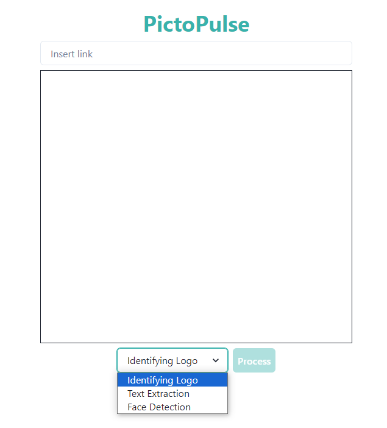


I wanted to try something new other than web app with CRUD operations. And needed to learn how to deploy multiple Spring Boot apps on GCP (which could be useful for microservices) and, at the same time, learn about Cloud Vision API.    
*The App is a little slow as I'm using Free tier*



## What I learned from the project?
For frontend development, it was just like a revision as I've been using React/NextJS for 3-4 years. For backend, Spring Boot was already taking care of starting a server and handling HTTP requests. So, it was easy.

I mostly learned understanding Google Cloud Platform, authenticating properly on development environment to use its services and finally deploying the backend as I was new to using GCP. 

When I deploy the app for the first time, it was overriding the restaurant-web-app I deployed previously. So, I had to revert it and find out another method. Luckily, it wasn't that hard, I just need to configure the app with *app.yaml* file.

## About the App

The app can identify logos, extract text and detect faces from an image. Currently, it only accepts image with URL. The **Process** button is disabled if the URL is empty.

The user can only click **Process** if the URL is valid (a mistake I learned from restaurant-web-app) or otherwise the button is disabled.

Removed the domain name to test with invalid URL.

With valid URL and correct mode, the backend will send the response.

I also did a little bit of error handling in the backend. If the photo doesn't match with the selected option, the user will be notified with an error.

* [Demo](https://image-processing-app-frontend.vercel.app/) 
* [Code for NextJS](https://github.com/Wai30Yan/image-processing-app-frontend)
* [Code for Spring Boot](https://github.com/Wai30Yan/image-processing-app-backend)